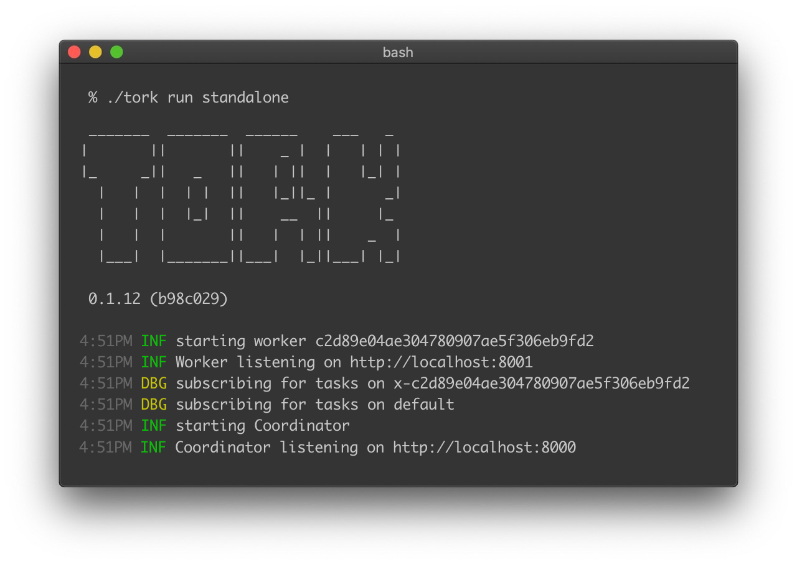

<h1 align="center">
  
   
</h1>

  

  <a href="#features">Features</a> •
  <a href="https://www.tork.run/installation">Installation</a> •
  <a href="https://www.tork.run">Documentation</a> •
  <a href="#quick-start">Quick Start</a> •
  <a href="https://www.tork.run/rest">REST API</a> •
  <a href="https://www.tork.run/web-ui">Web UI</a>

Tork is a highly-scalable, general-purpose workflow engine.

## Features:

<h1 align="center">
  
   
</h1>

- [REST API](https://www.tork.run/rest)
- [Highly extensible](https://www.tork.run/extend)
- Horizontally scalable
- Task isolation - tasks are executed within a container to provide isolation, idempotency, and in order to enforce resource [limits](https://www.tork.run/tasks#limits)
- Automatic recovery of tasks in the event of a worker crash
- Supports both stand-alone and [distributed](https://www.tork.run/installation#running-in-a-distributed-mode) setup
- [Retry failed tasks](https://www.tork.run/tasks#retry)
- [Middleware](https://www.tork.run/extend#middleware)
- Support for [Docker](https://www.tork.run/runtime#docker), [Podman](https://www.tork.run/runtime#podman) and [Shell](https://www.tork.run/runtime#shell) runtimes.
- [Webhooks](https://www.tork.run/jobs#webhooks)
- [Pre/Post tasks](https://www.tork.run/tasks#pre-post-tasks)
- No single point of failure
- Task timeout
- [Full-text search](https://www.tork.run/rest#list-jobs)
- [Expression Language](https://www.tork.run/tasks#expressions)
- [Conditional Tasks](https://www.tork.run/tasks#expressions)
- [Parallel Tasks](https://www.tork.run/tasks#parallel-task)
- [For-Each Task](https://www.tork.run/tasks#each-task)
- [Subjob Task](https://www.tork.run/tasks#sub-job-task)
- [Task Priority](https://www.tork.run/tasks#priority)
- [Secrets](https://www.tork.run/tasks#secrets)
- [Scheduled Jobs](https://tork.run/jobs#scheduled-jobs)
- [Web UI](https://www.tork.run/web-ui)

## Documentation

See [tork.run](https://tork.run) for the full documentation.

## Quick Start

See the [Quick Start Guide](https://www.tork.run/quick-start) for detailed instructions on how to get up and running with Tork.

## REST API

See the [REST API](https://www.tork.run/rest) documentation.

## Web UI

[Tork Web UI](https://www.tork.run/web-ui) is a web based tool for interacting with Tork. Run jobs, debug and visualize them with an intuitive GUI.

## License

Copyright (c) 2023-present Arik Cohen. Tork is free and open-source software licensed under the MIT License.
