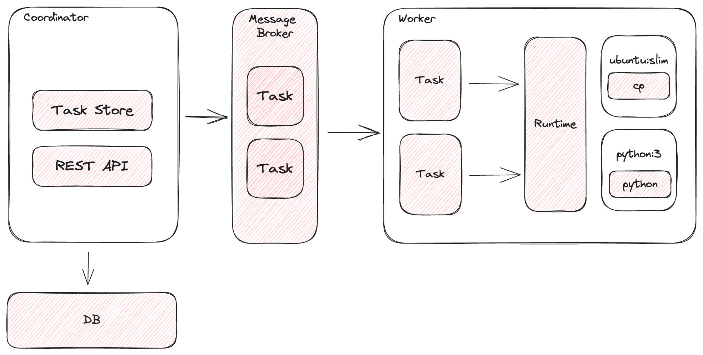

# Tork

A distributed workflow engine.

**Note: This project is currently a work in progress (WIP) and is not recommended for production use.**

# Features:

- REST API
- Submit individual tasks or workflows for execution.
- Horizontally scalable
- Task isolation - tasks are executed within a container to provide isolation, idempotency, and in order to enforce resource limits
- Automatic recovery of tasks in the event of a worker crash
- Supports both stand-alone and distributed setup
- Retry failed tasks
- Pre/Post tasks
- Expression Language

# Architecture



**Coordinator**: responsible for managing the lifecycle of a task through its various states and for exposing a REST API to the clients.

**Worker**: responsible for executing tasks by means of a runtime (typically Docker).

**Broker**: the message-queue, pub/sub mechanism used for routing tasks.

**Datastore**: holds the state for tasks and jobs.

**Runtime**: the platform used by workers to execute tasks. Currently only Docker is supported.

# Hello World

Start in `standalone` mode:

```
go run cmd/main.go -mode standalone
```

Submit task in another terminal:

```
TASK_ID=$(curl \
  -s \
  -X POST \
  -H "content-type:application/json" \
  -d '{"image":"ubuntu:mantic","cmd":["echo","-n","hello world"]}' \
  http://localhost:3000/task | jq -r .id)
```

Query for the status of the task:

```
# curl -s http://localhost:3000/task/$TASK_ID | jq .

{
  ...
  "state": "COMPLETED",
  "result": "hello world"
}
```

# A more interesting example

1. Download a remote video file using a `pre` task to a shared `/tmp` volume.
2. Convert the first 5 seconds of the downloaded video using `ffmpeg`.
3. Upload the converted video to a destination.

```

// convert.json

{
  "name": "convert the first 5 seconds of a video",
  "image": "jrottenberg/ffmpeg:3.4-scratch",
  "cmd": [
    "-i",
    "/tmp/input.ogv",
    "-t",
    "5",
    "/tmp/output.mp4"
  ],
  "volumes": ["/tmp"],
  "pre": [{
    "name": "download the remote file",
    "image": "alpine:3.18.3",
    "cmd": [
      "wget",
      "https://upload.wikimedia.org/wikipedia/commons/1/18/Big_Buck_Bunny_Trailer_1080p.ogv",
      "-O",
      "/tmp/input.ogv"
    ]
  }],
  "post": [{
    "name": "upload the remote file",
    "image": "alpine:3.18.3",
    "cmd": [
      "wget",
      "--post-file=/tmp/output.mp4",
      "https://devnull-as-a-service.com/dev/null"
    ]
  }]
}
```

Submit the task:

```
TASK_ID=$(curl -s -X POST -d @convert.json http://localhost:3000/task | jq -r .id)
```
